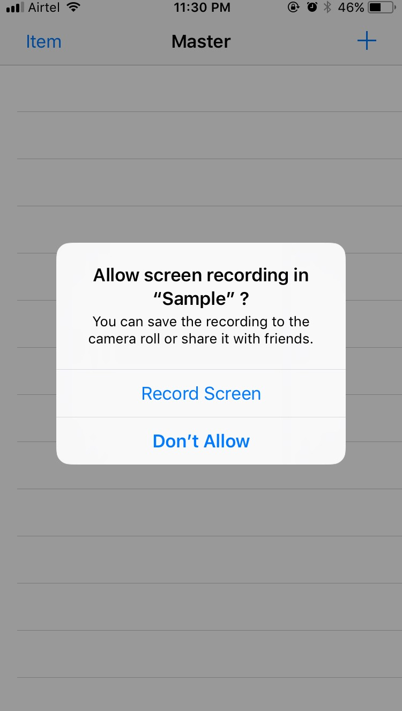
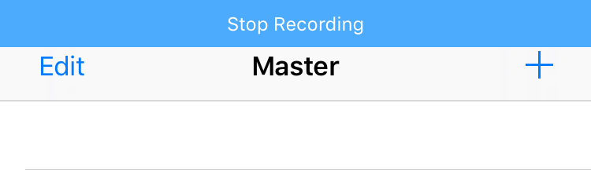

# ScreenRecord

This is a wrapper for screen recording on iOS with ReplayKit2. 
</br>
[Blog](https://medium.com/@giridharvc7/replaykit-screen-recording-8ee9a61dd762)




## Usage

Screen recording is abstracted to a single function 

```
ScreenRecordCoordinator().startRecording(withFileName: "coolScreenRecording1", recordingHandler: { (error) in
            print("Recording in progress")
        }) { (error) in
            print("Recording Complete")
        }
```

## Features

* Automatically adds a `stop recording` overlay to the app, so that the user can stop the recording
* Writes Videos to the documents directory in `Replays` folder


## Contributions

Please feel free to contribute to the project :) 

## License
MIT License